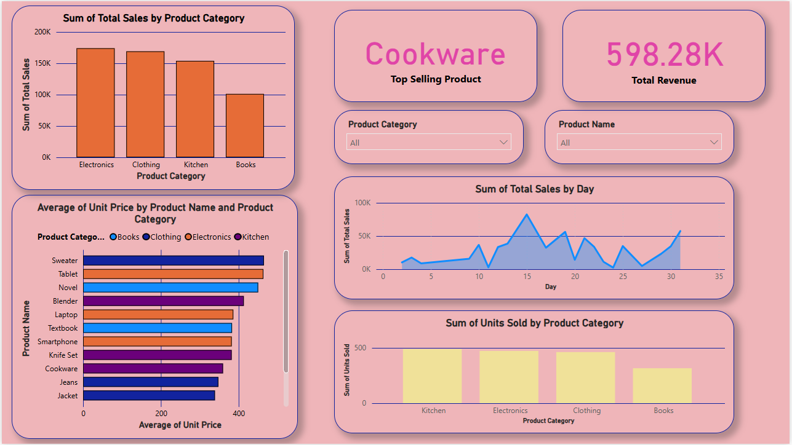

# 📦 Product Category Insights Dashboard – Power BI Project

This project is a **Power BI dashboard** built to visualize and analyze sales data across various product categories including **Electronics, Clothing, Kitchen, and Books**. The goal is to gain actionable insights into revenue generation, product performance, and pricing trends.

## 📊 Dashboard Highlights

- **Top Selling Product**: Cookware
- **Total Revenue**: ₹598.28K
- **Product Categories Covered**: Electronics, Clothing, Kitchen, Books
- **Interactive Filters**:
  - Product Category
  - Product Name

### 📈 Visualizations Included

- **Sum of Total Sales by Product Category**
- **Sum of Units Sold by Product Category**
- **Average Unit Price by Product Name & Category**
- **Sales Trend by Day**
- **Top Selling Product Indicator**
- **Total Revenue KPI**

## 🛠️ Tools Used

- **Power BI**
- **Microsoft Excel** (for data preprocessing and modeling)

## 📂 File Structure

- `Praveen_ZapicalExcelTest.xlsx` – Raw dataset used for the dashboard
- `SalesDashboard.pbix` – Power BI file *(optional if shared)*
- `AssignmentDashboard.png` – Contains dashboard visuals
- `README.md` – Project documentation

## 📸 Preview

## 🚀 How to Use

1. Open the `.pbix` file in Power BI Desktop.
2. Connect or load the `Praveen_ZapicalExcelTest.xlsx` file.
3. Explore the visuals and interact with filters to gain insights.
4. Customize or extend the report as per your analysis needs.

## 📎 Related Projects

You can also check out more of my work here:
👉 [GitHub Profile](https://github.com/praveen5102) *(Replace with your actual GitHub URL)*

---

📬 **Developed by:** [Gone Praveen Kumar]  
📧 **Email:** praveenkumargone229@gmail.com

